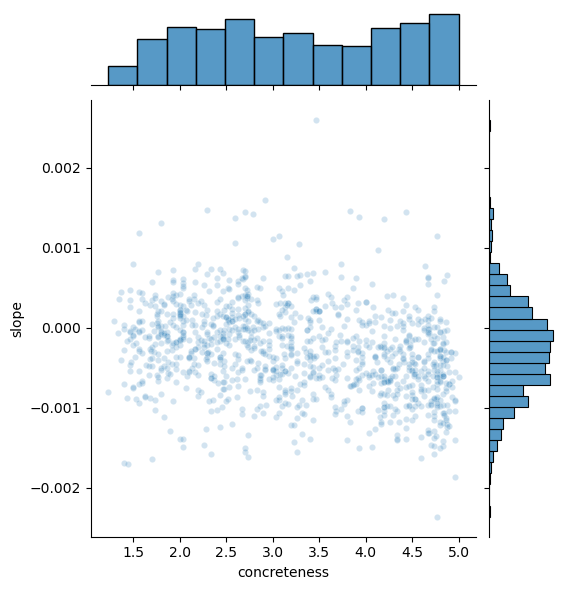

# Evolution of Linguistic Diversity (In Development)

This project explores how words evolve to have multiple meanings over time and how people's sensitivity to word variations affects the way word meanings change. We use word2vec embeddings, generate graph networks of words with high similarities and derive the coexistence of multiple word meanings (polysemy) using the local clustering coefficient. As a proxy for sensitivity to word variations, we use word concreteness ratings.

**Note**: The project is currently in development. Its present version includes the German language, covering the time period from the 1950s to the 1990s.


## Datasets


### Word2Vec Embeddings
- **Historical** [HistWords: Word Embeddings for Historical Text](https://nlp.stanford.edu/projects/histwords/) [1]
- **Contemporary** [NLPL word embeddings repository](http://vectors.nlpl.eu/repository/) [2]

### Concreteness Ratings
- **German**: [Automatically Generated Affective Norms of Abstractness, Arousal, Imageability and Valence for 350 000 German Lemmas](https://aclanthology.org/L16-1413/) [3]


## Get Started


To set up the project environment and install all necessary dependencies, please run the following command:

```
pip install -r requirements.txt
```

To download and preprocess the datasets, run [main.py](main.py). The external data for German requires **3.9 GB**. 

```
python main.py -l german
```

To recreate the results, you can run the [run.ipynb](run.ipynb) notebook.


## Intermediary Results

So far, we have identified a moderate positive correlation (0.4) between people’s sensitivity to word variations and an increase in polysemy. This correlation was determined by analyzing the Spearman Rank Correlation Coefficient of word concreteness ratings and the rate of change in word polysemy across decades, from the 1950s to the 1990s. The scatterplot below shows this relationship between those variables. 




## Upcoming 

The next steps in this project are:

- [ ] Adding similar results for English and French
- [ ] Validate the results for German by using concreteness ratings from a different source
- [ ] Validating the polysemy scores and potentially adjusting the cosine similarity cutoff for generating the graph network
- [ ] Control our findings for word frequency


## Sources


[1] [W. L. Hamilton, J. Leskovec, and D. Jurafsky, "Diachronic Word Embeddings Reveal Statistical Laws of Semantic Change," in Proceedings of the 54th Annual Meeting of the Association for Computational Linguistics (Volume 1: Long Papers), 2016, pp. 1489-1501.](https://nlp.stanford.edu/projects/histwords/)

[2] [M. Fares, A. Kutuzov, S. Oepen, and E. Velldal, "Word vectors, reuse, and replicability: Towards a community repository of large-text resources," in Proceedings of the 21st Nordic Conference on Computational Linguistics, NoDaLiDa, 22-24 May 2017, J. Tiedemann, Ed. Linköping University Electronic Press, ISBN 978-91-7685-601-7.](http://vectors.nlpl.eu/repository/)

[3] [M. Köper and S. Schulte im Walde, "Automatically Generated Affective Norms of Abstractness, Arousal, Imageability and Valence for 350 000 German Lemmas," in Proceedings of the Tenth International Conference on Language Resources and Evaluation (LREC'16), Portorož, Slovenia, May 2016, pp. 2595-2598.](https://aclanthology.org/L16-1413)

